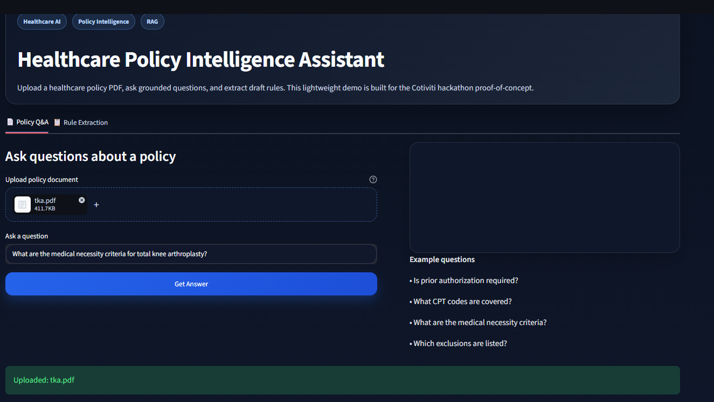
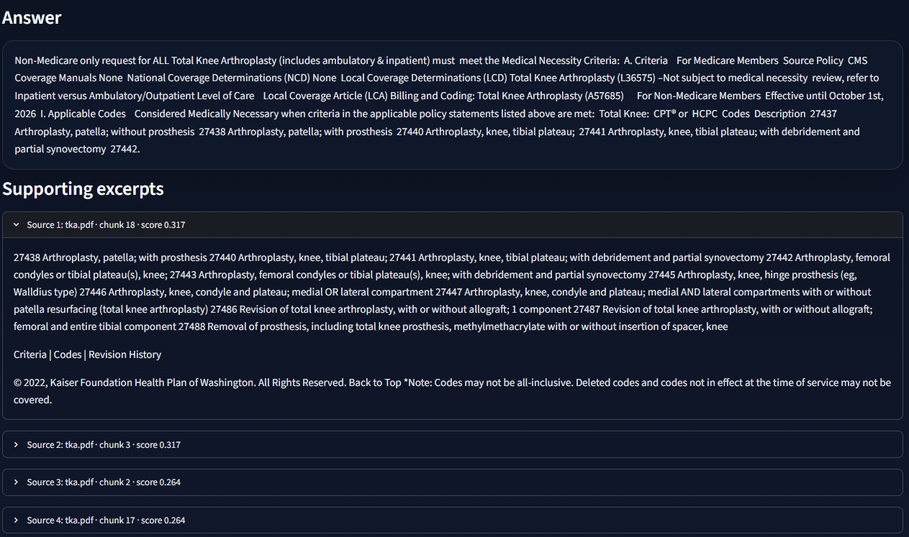
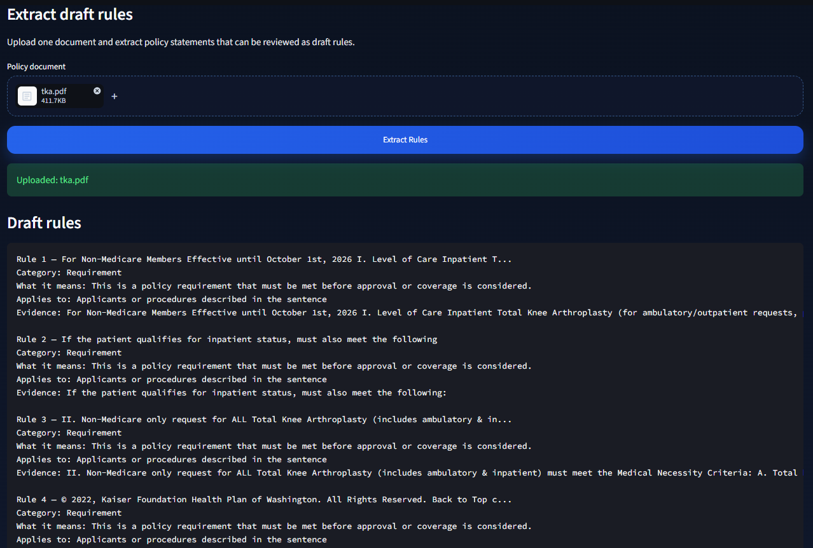

# 🏥 Healthcare Policy Intelligence Assistant

> **AI-Powered Healthcare Content Management using Semantic Search, Document Intelligence, and Rule Extraction**


---

# 📦 Assessment Deliverables

This repository contains all deliverables submitted for the **Cotiviti Generative AI Developer Internship Technical Assessment**.

| Deliverable | File |
|-------------|------|
| 📄 Written Report | `Report.docx` |
| 💻 Proof of Concept | `app.py` |
| 📊 PowerPoint Presentation | `Presentation.pptx` |
| 🎥 Application Demonstration | `Recording/demo.mp4` |

---

# 📖 Project Overview

Healthcare organizations manage thousands of pages of clinical guidelines, billing policies, coding manuals, payer contracts, and CMS regulations.

Reviewing these documents manually is time-consuming, repetitive, and difficult to scale.

This project demonstrates how AI can improve healthcare content management by enabling users to:

- 📄 Upload healthcare policy documents
- 💬 Ask policy-related questions using natural language
- 📋 Extract structured draft policy rules
- 🔍 Retrieve evidence directly from the uploaded document

This proof of concept demonstrates the foundational capabilities required for **AI-assisted healthcare policy understanding and rule authoring**, supporting future enterprise workflows such as policy automation and payment integrity.

---

# 🎯 Problem Statement

Healthcare organizations continuously process:

- Billing & Coding Policies
- Clinical Practice Guidelines
- Prior Authorization Policies
- CMS Regulations
- Payer–Provider Contracts

Policy updates occur frequently and require healthcare professionals to manually interpret changes before implementing them operationally.

This creates challenges including:

- Manual document review
- Administrative burden
- Inconsistent policy interpretation
- Delayed operational updates
- Increased compliance risk

The objective of this project is to demonstrate how Generative AI can reduce manual policy review while maintaining transparency and human oversight.

---

# 🚀 Features

## 📄 Policy Question Answering

Upload a healthcare policy document and ask questions such as:

- What are the medical necessity criteria?
- What documentation is required?
- Which CPT codes are covered?
- What exclusions exist?

The system retrieves relevant sections from the uploaded document and generates evidence-backed answers.

---

## 📋 Rule Extraction

Automatically converts healthcare policy statements into structured draft rules that can support healthcare analysts during policy review.

Example:

```
Rule

Medical records may be required.

Category

Documentation

Meaning

Coverage reviewers may request supporting
clinical documentation before approving
the requested service.

Evidence

Medical records documentation may be
required to assess whether the member
meets the clinical criteria.
```

---

## 🔍 Evidence Retrieval

Every generated response includes supporting excerpts from the uploaded healthcare policy, allowing users to verify AI-generated answers against the original document.

---

# 🏗️ System Architecture

```
Healthcare Policy PDF
          │
          ▼
    Document Parsing
       (PyMuPDF)
          │
          ▼
      Text Chunking
          │
          ▼
   Semantic Retrieval
      (TF-IDF)
          │
          ▼
 Policy Question Answering
          │
          ▼
    Rule Extraction
          │
          ▼
 Structured Draft Rules
```

---

# 💻 Technology Stack

| Technology | Purpose |
|------------|---------|
| Python | Backend Development |
| Streamlit | User Interface |
| PyMuPDF | PDF Parsing |
| Scikit-learn | Semantic Retrieval (TF-IDF) |
| Pandas | Data Processing |
| JSON | Structured Rule Export |

---

# 📂 Project Structure

```
Healthcare-Policy-Intelligence/

│
├── app.py
├── README.md
├── requirements.txt
├── Report.docx
├── Presentation.pptx
│
├── Recording/
│     └── demo.mp4
│
├── screenshots/
│     ├── home.png
│     ├── qa.png
│     └── rules.png
│
├── assets/
│     └── style.css
│
├── uploads/
│
└── src/
      ├── document_io.py
      ├── rag.py
      └── rule_extractor.py
```

---

# 🖼️ Application Preview

## Home



---

## Policy Question Answering

Upload a healthcare policy and ask natural language questions.

The application retrieves relevant sections and generates evidence-backed responses.



---

## Rule Extraction

Healthcare policy statements are converted into structured draft rules for analyst review.



---

# ⚙️ Installation

Clone the repository

```bash
git clone https://github.com/shubhpatil27/healthcare-policy-intelligence.git
```

Navigate to the project

```bash
cd healthcare-policy-intelligence
```

Create a virtual environment

```bash
python -m venv venv
```

Activate the virtual environment

### Windows

```bash
venv\Scripts\activate
```

### macOS / Linux

```bash
source venv/bin/activate
```

Install all dependencies

```bash
pip install -r requirements.txt
```

Run the application

```bash
streamlit run app.py
```

Open the application in your browser

```
http://localhost:8501
```

---

# 🧪 Demonstration Workflow

1. Launch the Streamlit application.
2. Upload a healthcare policy PDF.
3. Ask policy-related questions.
4. Review AI-generated responses.
5. Verify supporting evidence.
6. Extract structured policy rules.
7. Download extracted rules as JSON.

---

# 📄 Example Documents

The application has been tested using publicly available healthcare policy documents, including:

- Kaiser Permanente Clinical Review Criteria
- UnitedHealthcare Medical Policies

---

# 🔮 Future Enhancements

Potential future improvements include:

- Vector Database Integration (FAISS / ChromaDB)
- Enterprise Retrieval-Augmented Generation (RAG)
- LLM-powered Policy Comparison
- Healthcare Knowledge Graph
- Policy Version Tracking
- IF–THEN Rule Generation
- Multi-document Reasoning
- Explainable AI with Confidence Scoring

---

# 🎯 Business Value

This project demonstrates how AI can support healthcare content management by:

- Reducing manual policy review effort
- Improving document accessibility
- Supporting evidence-based decision making
- Transforming unstructured policy documents into structured knowledge
- Providing a foundation for future AI-assisted policy automation

---

# 👨‍💻 Author

**Shubham  Patil**

Master of Science in Data Science

Arizona State University

GitHub: https://github.com/shubhpatil27

---

# 📌 Disclaimer

This repository was developed as part of the **Cotiviti Generative AI Developer Internship Technical Assessment**.

The application is intended solely as a proof of concept demonstrating AI-assisted healthcare content management. It is not intended for clinical decision-making or production healthcare use.
